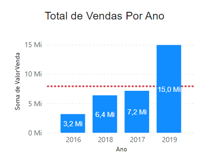
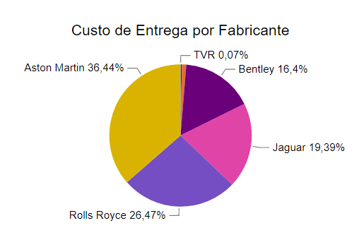
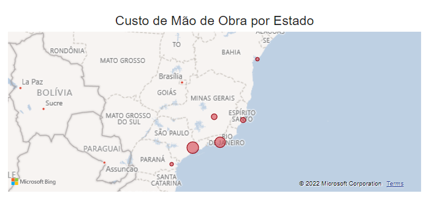
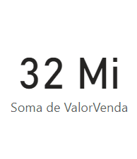
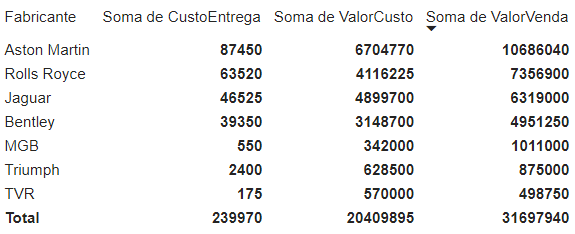

- 
- ## O problema
	- Você é Analista de Dados na empresa XYZ Corporation International, uma revendedora de automóveis de luxo com sede em São Paulo. A empresa começou sua operação no Brasil em 2016 e atua nos quatro estados da região sudeste, mais os estados do Paraná e Bahia. Seu  gerente  vai  apresentar  os  resultados  da  equipe comercial  para  o  novo  CEO  da empresa e precisa da sua ajuda para construir um Dashboard que represente os dados de vendas no período de 2016 a 2019. Sua fonte de dados é um arquivo Excel com dados coletados do sistema de vendas e CRM da empresa, com a as seguintes colunas:
	-
	- | Coluna         | Descrição                                           |
	  |----------------|-----------------------------------------------------|
	  | DataNotaFiscal | Data de emissão da nota fiscal.                     |
	  | Fabricante     | Fabricante do veículo.                              |
	  | Estado         | Estado onde foi realizada a venda.                  |
	  | PrecoVenda     | Preço de venda do veículo.                          |
	  | PrecoCusto     | Preço de custo do veículo para a empresa.           |
	  | TotalDesconto  | Total do desconto fornecido sobre o preço de venda. |
	  | CustoEntrega   | Custo de entrega do veículo ao proprietário.        |
	  | CustoMaoDeObra | Custo de mão de obra (Secretária, mecânico, etc...) |
	  | NomeCliente    | Nome do cliente que comprou o veículo.              |
	  | Modelo         | Modelo do veículo.                                  |
	  | Cor            | Cor do veículo.                                     |
	  | Ano            | Ano de fabricação do veículo.                       |
	-
	- Seu gerente precisa das seguintes informações:
		- 1º - Total de Vendas por Ano.
		- 2º - Custo de Entrega do Veículo por Fabricante.
		- 3º - Custo de Mão de Obra Por Estado.
		- 4º - Total de Vendas Geral e Matriz de Vendas.
	-
	- Além disso, pode ser interessante, se o CEO puder visualizar o total de vendas por estado e  se  as  vendas  estão  acima  ou  abaixo  da  média.  Seu  gerente  já  sabe  que  um  assunto  será abordado pelo CEO durante a apresentação. O CEO está avaliando se continua ou não com a venda de automóveis da marca Jaguar e ele gostaria de saber como evoluíram as vendas de automóveis deste fabricante por ano e por estado
-
- ## A solução do problema
	- 1º -  Total de vendas por ano:
		- Com base no gráfico abaixo, podemos afirmar que os anos de 2017 e 2019 foram onde ocorreram os maiores picos de vendas de carros, sendo a linha vermelha pontilhada representando a média de vendas do setor.
		- 
	- 2º - Custo de Entrega do Veículo por Fabricante
		- Com base no gráfico abaixo, podemos afirmar que as empresas com maiores custos de entrega são a Aston Martin com 36,44% e em segundo a Rolls Royce com 26,47%.
		- 
	- 3º - Custo de Mão de Obra Por Estado.
		- Com base no mapa abaixo, podemos visualizar que são nos estados de São Paulo, Rio de Janeiro e Minas gerais os maiores custos de mão de obra.
		- 
	- 4º - Total de Vendas Geral e Matriz de Vendas.
		- A imagem abaixo, mostra o total de vendas geral
		- 
		- Já na seguinte imagem abaixo, podemos visualizar o resultado da Matriz de vendas.
		- 
